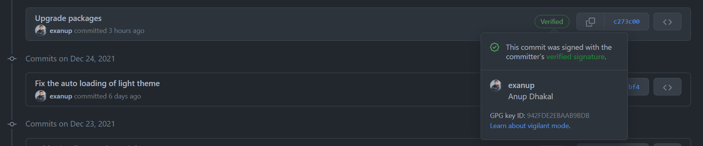
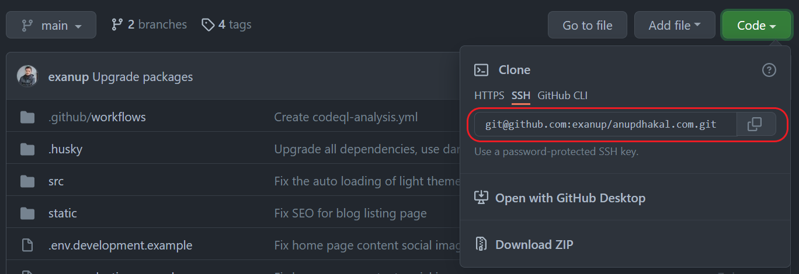

The main idea is to have two SSH profiles switchable with corresponding shell
commands, one for the work and another for the personal projects. A different
way would have been to just use HTTPS in Github instead of SSH, but that comes
with it's own set of annoyances, which this article will not be diving into
today. Instead, the goal here will be to have two custom aliases, `gitp` for
personal, and `gitw` for work, which do the required switching.

```toc
# This code block gets replaced with the TOC
```

## Background

When fetching from a private Github repository via SSH connection, the public
keys are exchanged between your machine and the Git server. This is when Git
verifies the machine's SSH key from the list of the SSH keys Github present in
the Github account. This is a very simplified explanation, but it works for our
purpose.

The above flow is fine, until we need to work on our personal project that we
have set as private. We simply get permission error when trying to fetch or push
to that personal repository. The reason is that we don't have the work related
SSH key added to our personal Github. Let's say that we don't want to do that,
as we want to keep things (like email and SSH keys) separated.

So, how can we solve that? One easy way could be to set repo level Github
configs. For example, running
`git config user.email personal_email@example.com`, and other similar commands
in the shell while being inside the project directory should do the job. This is
very flexible, however, I like having a way to just set these values as globals
and get on with the project. I see it like this: if it's time to work on my
employer's / client's stuff, switch to the work mode, and when the work hours
are over, switch to the personal mode. I hope the idea is clearer.

Don't worry if you got lost somewhere though, as we will go through all the
steps, from generating keys and adding them to our Github accounts, to (as bonus
content) even using them to sign every commit we make, so that it shows as a
verified commit in the Github.



Now let's start with the setup!

## Generating SSH keys

I have taken the reference from the
[Github docs regarding generating the SSH keys](https://docs.github.com/en/authentication/connecting-to-github-with-ssh/generating-a-new-ssh-key-and-adding-it-to-the-ssh-agent).
The steps here should work for any UNIX (-like) shell (Linux, Mac OS, Git Bash
for Windows, etc.) If you encounter an error, try following the above reference.

1. Open the terminal and then type the following in the shell, with your correct
   personal email, of course.

    ```bash
    ssh-keygen -t ed25519 -C "personal_email@example.com"
    ```

    Immediately after running the above, you should get a prompt to enter the
    location where the generate file is to be saved. If you don't enter
    anything, it will be saved in the default path, for example,
    `/home/[user]/.ssh/id_ed25519`, where `[user]` is whatever the actual
    username in your machine is. However, since we want to have multiple
    profiles, let's make the file name a little bit more meaningful by adding
    `-personal` as the suffix. Hence, let's copy the default path from the
    prompt itself, and replace the filename from `id_ed25519` to
    `id_ed25519-personal`. The response to the prompt should look something like
    `/home/[user]/.ssh/id_ed25519-personal`. Again, let's not forget to replace
    `[user]` with the actual username. Now finally, hit `Enter ⏎`.

2. Immediately, a new prompt asks for the passphrase. You can choose to not have
   a passphrase. Details on that is beyond the scope of this guide. So just hit
   `Enter ⏎` a couple more times to get the SSH key generated. To confirm if the
   files have been generated at the correct location, run `ls -l ~/.ssh`. The
   output should look something like this:

    ```bash
    -rw------- 1 [user] [user] 419 Dec 29 16:50 id_ed25519-personal
    -rw-r--r-- 1 [user] [user] 106 Dec 29 16:50 id_ed25519-personal.pub
    ```

3. Now repeat the above steps 1 and 2, but for work profile. This means you want
   to run the commands again, but with the work email and `-work` prefix, as
   shown below:

    ```bash
    ssh-keygen -t ed25519 -C "work_email@example.com"
    ```

    In the prompt, enter `/home/[user]/.ssh/id_ed25519-work`, and hit `Enter ⏎`.
    When asked about the passphrase, simply ignore it and hit `Enter ⏎` a couple
    more times. After that running command `ls -l ~/.ssh` should give an output
    like the following:

    ```bash
    -rw------- 1 [user] [user] 419 Dec 29 16:50 id_ed25519-personal
    -rw-r--r-- 1 [user] [user] 106 Dec 29 16:50 id_ed25519-personal.pub
    -rw------- 1 [user] [user] 411 Dec 29 16:49 id_ed25519-work
    -rw-r--r-- 1 [user] [user] 101 Dec 29 16:49 id_ed25519-work.pub
    ```

    Notice the two new work related keys.

4. Now time to create the SSH configs. Run the following in the command prompt.

    ```bash
    touch ~/.ssh/config-personal
    touch ~/.ssh/config-work
    ```

    Open the `~/.ssh/config-personal` file and edit it to have the content as
    follows.

    ```bash
    Host *
        IgnoreUnknown UseKeychain
        UseKeychain yes
        AddKeysToAgent yes
        IdentityFile ~/.ssh/id_ed25519-personal
        IdentitiesOnly yes
    ```

    Similarly, edit `~/.ssh/config-work` to have the following content.

    ```bash
    Host *
        IgnoreUnknown UseKeychain
        UseKeychain yes
        AddKeysToAgent yes
        IdentityFile ~/.ssh/id_ed25519-work
        IdentitiesOnly yes
    ```

5. Let's add the keys to the ssh-agent next. But first, the ssh-agent needs to
   be started, like so:

    ```bash
    eval "$(ssh-agent -s)"
    ```

    Expected output: `Agent pid 59566`

    Note that pid might be a different number.

    > **Note from the Github docs:** Depending on your environment, you may need
    > to use a different command. For example, you may need to use root access
    > by running `sudo -s -H` before starting the ssh-agent, or you may need to
    > use `exec ssh-agent bash` or `exec ssh-agent zsh` to run the ssh-agent.

    Next, run one of the following commands depending upon your machine.

    For Mac OS

    ```bash
    ssh-add -K ~/.ssh/id_ed25519-personal
    ssh-add -K ~/.ssh/id_ed25519-work
    ```

    For Linux

    ```bash
    ssh-add ~/.ssh/id_ed25519-personal
    ssh-add ~/.ssh/id_ed25519-work
    ```

## Adding aliases to switch between the profiles

Now, the SSH keys are ready to be added to the respective Github accounts.
However, there is not a way to activate the specific config, yet. Let's fix that
first, and then move to adding the SSH keys to the Github account.

Open your shell's corresponding rc file, for example `.bashrc` for Bash or
`.zshrc` for Zsh, and append the following lines at the end.

```bash
alias gitp="git config --global core.sshCommand \"ssh -F ~/.ssh/config-personal\" && \
            git config --global user.email personal_email@example.com && \
            git config --global user.name \"My Name\" && \
            echo \"Switched git to personal profile\""

alias gitw="git config --global core.sshCommand \"ssh -F ~/.ssh/config-work\" && \
            git config --global user.email work_email@example.com && \
            git config --global user.name \"My Name\" && \
            echo \"Switched git to work profile\""
```

We are basically creating a couple of aliases which are going to work as our
commands for switching to the personal and work profiles easily just by running
the `gitp` and `gitw` commands.

## Adding SSH keys to Github

To add the SSH keys that we generated earlier, just follow
[the Github documentation](https://docs.github.com/en/authentication/connecting-to-github-with-ssh/adding-a-new-ssh-key-to-your-github-account).
We can find all sorts of screenshots to help us out.

Remember to follow the steps two times: first, add the personal SSH public key
`~/.ssh/id_ed25519-personal.pub` to your personal Github, and then again the
work SSH public key `~/.ssh/id_ed25519-work.pub` to your work Github account.

## Party Time

Let's try out to see if our hard-work pays off!

### Personal Github

In the web browser, from the personal Github open any of the private
repositories, and copy the SSH URL for the repo. It looks something like this:



In the terminal, run the following commands.

```bash
gitp # Expected output> "Switched git to personal profile"
git clone git@github.com:exanup/anupdhakal.com.git
```

If everything goes as expected, you should be able to successfully pull the
private repositories from our personal Github.

### Work Github

Now, let's repeat the above steps for any of the private repository from our
work Github.

```bash
gitw # Expected output> "Switched git to work profile"
git clone git@github.com:[organization]/[repository].git # Make sure to use proper repo URL here
```

## Bonus: Signing the Git commits

To sign Git commits, we first need to generate GPG keys and add them to our
Github accounts.

The Github documentation has the best illustration for
[generating the GPG key](https://docs.github.com/en/authentication/managing-commit-signature-verification/generating-a-new-gpg-key),
and
[uploading the key to the Github account](https://docs.github.com/en/authentication/managing-commit-signature-verification/adding-a-new-gpg-key-to-your-github-account).

Just like the previous steps, remember to enter the correct personal email
address while generating for the personal Github account, and upload it there.
Then, repeat that for the work profile, double checking the work email address
and the work Github account.

The fun part is now it's time to update the aliases `gitp` and `gitw` to allow
the Git commit signature with the correct key.

Again, open the shell's corresponding rc file, for example `.bashrc` for Bash or
`.zshrc` for Zsh, and update the following lines like so:

```diff
alias gitp="git config --global core.sshCommand \"ssh -F ~/.ssh/config-personal\" && \
            git config --global user.email personal_email@example.com && \
            git config --global user.name \"My Name\" && \
+           git config --global commit.gpgsign true && \
+           git config --global user.signingkey XXXXXXXXXXXXXXXX && \
            echo \"Switched git to personal profile\""

alias gitw="git config --global core.sshCommand \"ssh -F ~/.ssh/config-work\" && \
            git config --global user.email work_email@example.com && \
            git config --global user.name \"My Name\" && \
+           git config --global commit.gpgsign true && \
+           git config --global user.signingkey YYYYYYYYYYYYYYYY && \
            echo \"Switched git to work profile\""
```

Replace `XXXXXXXXXXXXXXXX` with the GPG key ID of your personal GPG key, and
`YYYYYYYYYYYYYYYY` with the GPG key ID of your work GPG key.

Now let's try to create the commits in the personal repo using `gitp` first and
pushing the commit. Also, try the same thing, but with the work profile; start
with `gitw` and then create and push a new commit.

Go to the Github and check the commits page. Hopefully, you should see the
"Verified" label in your latest commit.

## Conclusion

That's it! We should by now have working aliases `gitp` and `gitw`, which we can
use to easily switch between corresponding SSH profiles for Git.

There are a lot more stuff that we didn't go into the details, but those are out
of the scope for this post. Maybe in another post sometime in the future, we
will revisit those in more depth.

Also, this might have opened your mind to multiple possibilities, like creating
a dedicated command, instead of the two aliases, to achieve not just two, but
multiple SSH profiles. Happy tinkering!

What do you think about the above guide? Did it come in handy for your use case?
Feel free to DM me any suggestions or your issues in my
[Twitter](https://twitter.com/nup66), or just send me a message through the
[contact](/contact) portal.
